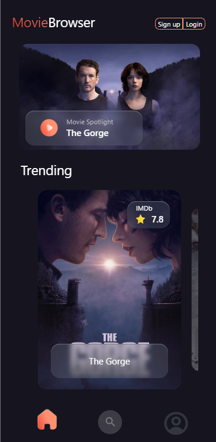

# 🎬 Movie browser web application

- Type of challenge: **learning**
- Repository : **`movieApp`**
- Hosting : Vercel

## 📖 Introduction :

Movie Browser is a web application that lets users discover movies. The app provides a modern, fluid interface for exploring movies, viewing their details, and receiving recommendations based on genres.

## 🎨 UI/UX Design :

The app's interface is designed with a modern layout, inspired by this [Layout Figma](https://www.figma.com/community/file/1029773770284800157)

## 🚀 Features
- Movie List: Browse a list of popular or trending movies.
- Movie Details: View detailed information about a specific movie.
- Genres and Categories: Filter movies by genre.
- Recommendations: Discover movies similar to those you like.
- Responsive Interface: The app is optimized for both desktop and mobile screens.

## 💻 Technologies Used

| Technology   | Purpose |
|-------------|---------|
| **React.js (Vite.js)** | Javascript Framework for building the interactive UI|
| **Tailwind CSS** | CSS framework for styling |
| **React Router** |For routing and navigation |
| **TMDB API** | Provides movie data for the app |

## 🛠️ Setup

### 1. Prerequisites

1. Before starting, make sure you have Node.js and npm installed:

```bash
node -v
npm -v
```
If Node.js and npm are not installed, download and install them from [Node.js Official Website](https://nodejs.org/fr) (npm is automatically installed when you install Node.js).

2. Clone the repository:
```bash
git clone git@github.com:Nora-H01/movieApp.git
```
3. Navigate to the project folder:
```bash
cd movie-app
```

### 2. Frontend setup
1. Navigate to the folder:
```bash
cd ../movie-app
```
2. Install dependencies:
```bash
npm install
```
3. Start the React development server in another terminal :
```bash
npm run dev
```
The frontend should now be running at http://localhost:3000.

## 🔀 Navigation 
- / → Home page (movie list)
- /discover → Movie discovery page
- /movie/:id → Movie details page (under development)
- /profile → User profile page (coming soon)

- Note: Currently, the profile icon redirects to the movie details page instead of the user profile page, as the profile feature is still a work in progress.
- The connection with the TMDB API is still a work in progress, and for now, placeholders are being used.

## Images
<div style="display: flex; justify-content: space-between;">
  
  
  
</div>

## 📋 API Documentation

- Use [The Movie Database API](https://developers.themoviedb.org/3/getting-started/introduction)
- Comply with the [terms of use](https://www.themoviedb.org/about/logos-attribution) of the API

## Ressources

- [Figma lean and level up](https://help.figma.com/hc/en-us)
- [TMDB API](https://developers.themoviedb.org/3/getting-started/introduction)
- [React API](https://beta.reactjs.org/)
- [React-router-dom](https://reactrouter.com/en/main)
